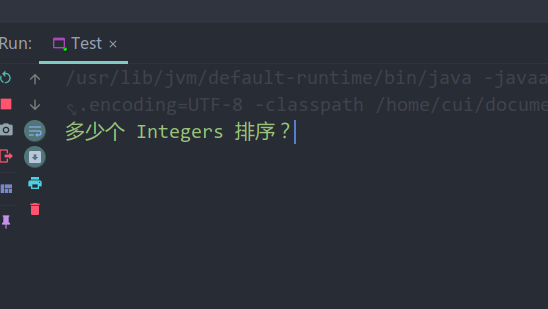
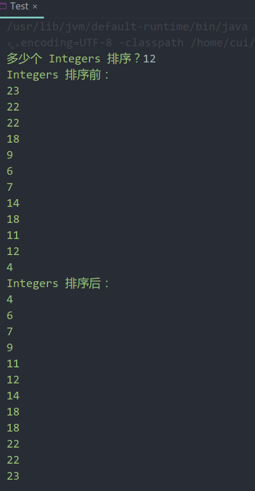
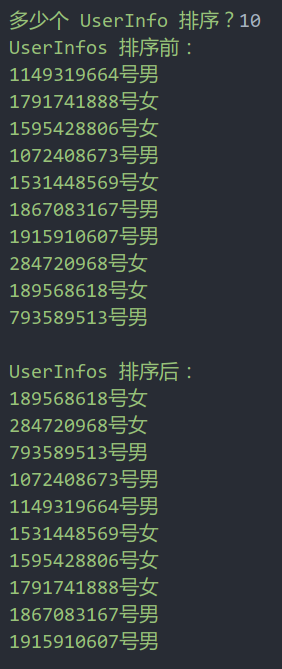

# 利用泛型定义抽象算法

## 主要 Java 类设计

### AbstractSort\<T> 类设计

AbstractSort\<T> 已基本给出，只要实现基于 compare 方法定义的排序方法 sort 即可。  
sort 使用 JDK 自带的排序方法：

```java
public static <T> void sort(@NotNull T[] a,
                            @Nullable java.util.Comparator<? super T> c)
```

通过方法引用即可实现 Comparator 类。

### Test 类设计

Test 类用来演示使用 Integer 数组和 UserInfo 数组排序测试。  
类方法定义如下：

```java
public static void main(String[] args)
private static UserInfo[] createRandomUserInfos(int size)
private static void show(Integer[] integers)
private static void show(UserInfo[] userInfos)
private static void testResultOfIntegersSorted(int size)
private static void testResultOfUserInfosSorted(int size)
```

其中，main 方法通过调用 testResultOfIntegersSorted 和 testResultOfUserInfosSorted 方法来分别测试对 Integer 和 UserInfo 的排序。两个被调用的方法分别完成对应类型数组的初始化、排序前的展示、排序、排序后的展示。

show 方法通过重载来实现不同类型数组的遍历输出。

由于 UserInfo 数组的创建较为复杂，故专门使用 createRandomUserInfos 来生成特定数目的随机  UserInfo 数组。

## 程序输入输出方式

### 输入

只需按如图要求从控制台输入要排序的数组规模即可：



### 输出

程序会自动输出排序前后的结果，如图：





<p align="right">author：崔书豪</p>