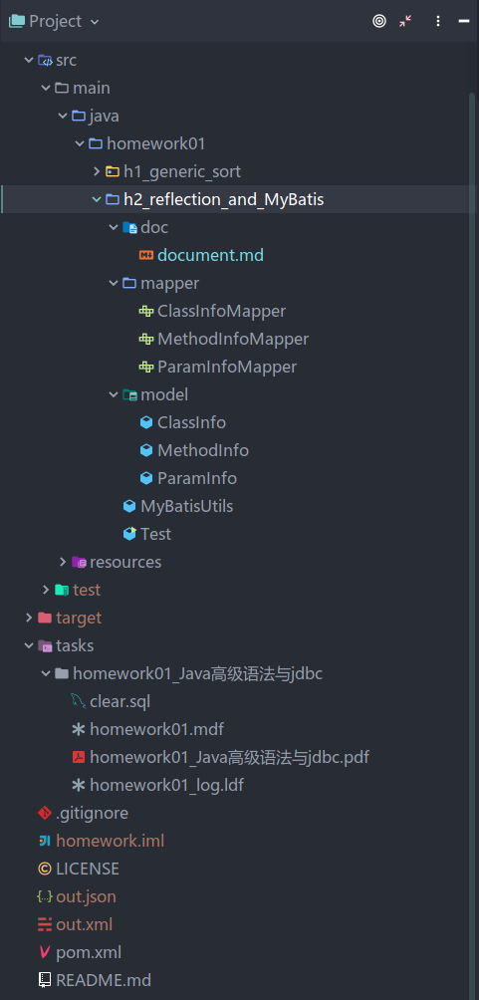
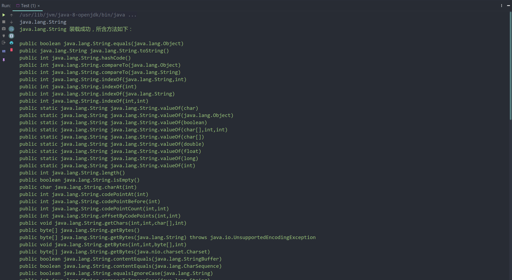
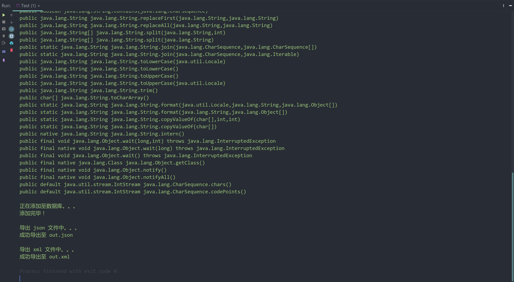
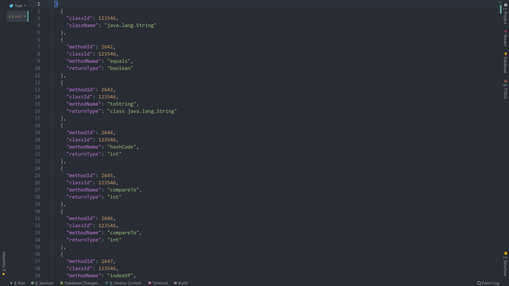
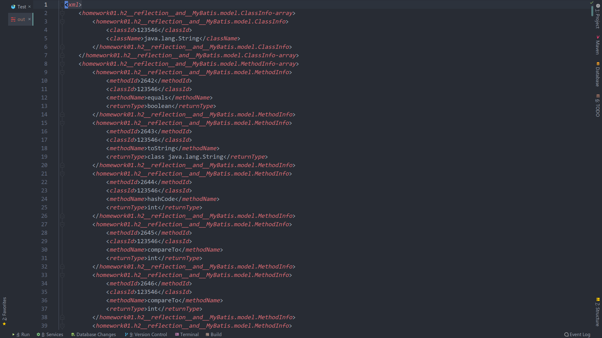

# 反射与MyBatis

本项目使用 Maven 进行构建，步骤参考 [Maven 入门](https://juejin.im/post/5b0f71e96fb9a00a031dfec1)，其它相关内容均参考课堂 PPT。  
项目结构如图所示：

## 主要 Java 类设计

### model 包

model 包有以下 JavaBean，作用是映射数据库中对应的三张表。

- ClassInfo
- MethodInfo
- ParamInfo

### mapper 包

mapper 包有以下接口及方法，作用是提供映射接口（参考 PPT），方法名顾名思义，不进行讲解。

- ClassInfoMapper

  - int selectClassIdByClassName(String ClassName)
  - void insertClassName(String className)
  - ClassInfo[] selectAllClassInfo()

- MethodInfoMapper

  - void insertMethodInfo(MethodInfo methodInfo)
  - MethodInfo[] selectAllMethodInfo()
  - int selectMaxMethodId()

- ParamInfoMapper

  - void insertParamInfo(ParamInfo paramInfo)
  - ParamInfo[] selectAllParamInfo()

### MyBatisUtils 类

与 PPT 定义的 MyBatisUtils 相同

### Test 类

Test 类为包含 main 方法的测试类，主要的逻辑也在其中，实现的功能有：

- 接收用户从控制台输入任意字符串作为类的完整名称，装载成功则打印方法信息到控制台
- 将查询到的类、方法和方法参数信息新增到 ClassInfo、MethodInfo 和 ParamInfo 表。
- 将 3 张表数据导出到一个 json 文件
- 将 3 张表数据导出到一个 xml 文件

Test 类包含的方法如下，方法名顾名思义，不进行讲解：

- private static void showMethods(Class classFromInput)
- private static void addToClassInfo(Class cls)
- private static void addToMethodInfo(int classId, Method method)
- private static void addToParamInfo(int methodId, Parameter[] parameters)
- private static void exportToJSON()
- private static void exportToXML()
- private static void writeFile(StringBuilder content, String fileExtension)

## 程序输入输出方式

### 输入

直接输入要处理的 java 类（如：java.lang.String）即可。

### 输出

- 控制台输出装载成功的类的方法信息
- 输出 3 张表数据到项目目录下的 out.json 文件
- 输出 3 张表数据到项目目录下的 out.xml 文件

输出样例图：

输出的 json 文件和 xml 文件（已手动格式化）：

崔书豪
